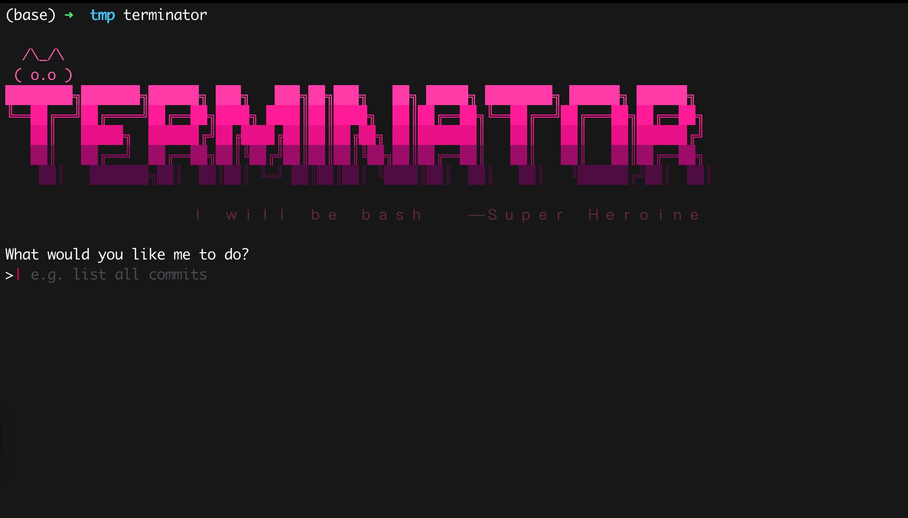

# Terminator

Terminator is a CLI that converts natural language into shell commands or scripts. It prints the generated command and a structured explanation, then asks you to **Run / Revise / Edit / Copy / Cancel** before execution.


See our introduction page!
<https://terminator-page.vercel.app/>

## Why Terminator

- Turn plain natural language into safe, reviewable shell commands
- Keep you in control: nothing runs until you select **Run**
- Fast demo flow: prompt → command → explanation → action

## Install

### Prerequisites
- Node.js v18+

### Local install (recommended for development)

```bash
git clone https://github.com/oodadoudou/Terminator.git
cd Terminator

npm install
npm run build

# Install globally from local folder
npm install -g .
````
## Configure

Open interactive config UI:

```bash
terminator config
```

Set values via CLI:

```bash
terminator config set OPENAI_KEY=YOUR_TOKEN
terminator config set OPENAI_API_ENDPOINT=YOUR_ENDPOINT
terminator config set MODEL=YOUR_MODEL
```

Config keys:

* `OPENAI_KEY`
* `OPENAI_API_ENDPOINT`
* `MODEL`
* `LANGUAGE`
* `SILENT_MODE`

Config file:

* `~/.terminator`

### Verify

```bash
terminator --version
terminator -s "whoami"
```

### Windows note (cmd / PowerShell)

On Windows, `terminator` may open an editor (for example VS Code) instead of running the CLI. This is a Windows npm shim issue with `.mjs` files. If that happens, use one of the options below:

```bat
:: Recommended: fix the npm shim
:: Edit %AppData%\npm\terminator.cmd
:: Change the last line to:
node "%dp0%\node_modules\terminator\dist\cli.mjs" %*

:: Temporary session alias
doskey terminator=node "%AppData%\npm\node_modules\terminator\dist\cli.mjs" $*

:: Direct run (always works)
node .\dist\cli.mjs -s "whoami"

```

## Usage

### Basic prompt

```bash
terminator "list all files in the current directory"
```

Example output (shape):

```text
Terminator ▶ Generated command

> ls

Explanation:
- Description: ...
- Steps:
  1) ...
  2) ...

What next?
→ Run       execute the command
Revise    ask AI to improve it
Edit      edit manually
Copy      copy to clipboard
Cancel    abort
```

### Silent mode (skip explanation)

```bash
terminator -s "whoami"
```

### Chat mode

```bash
terminator chat
```

Example (shape):

```text
Starting new conversation

You:
>| hi

Terminator:
Hello! How can I help you today?
```

## Docker

### Build only

```bash
docker build -t terminator:dev .
```

### Build + run (quick demo)

```bash
docker build -t terminator:dev . && \
docker run --rm -it \
  -v "$HOME/.terminator:/root/.terminator" \
  terminator:dev --version
```

### Build + run (prompt)

```bash
docker build -t terminator:dev . && \
docker run --rm -it \
  -v "$HOME/.terminator:/root/.terminator" \
  terminator:dev -s "whoami"
```

## Defaults (Hackathon)

Default values used for the hackathon environment:

* `OPENAI_API_ENDPOINT = https://llm.aiqu.ai`
* `MODEL = gpt-oss-120b`

This project is for the Chalmers AI Society x GoWest First-Ever Joint Hackathon and the Builderbase AIxia track .

LLMs used: https://llm.aiqu.ai provided by Aixia.

## Safety

* Terminator executes commands **only** if you explicitly select **Run**
* Use **Edit** to make final adjustments before running
* Use **Copy** to paste and inspect commands manually

## Hackathon

Built for the Chalmers AI Society × GoWest joint hackathon, Builderbase Aixia / AiQu track. 

Track:

* [https://www.builderbase.com/v2/track/aixia-track-orchestrate-ai-aiqu](https://www.builderbase.com/v2/track/aixia-track-orchestrate-ai-aiqu)

AiQu / LLM endpoint (hackathon):

* [https://llm.aiqu.ai/](https://llm.aiqu.ai/) 
